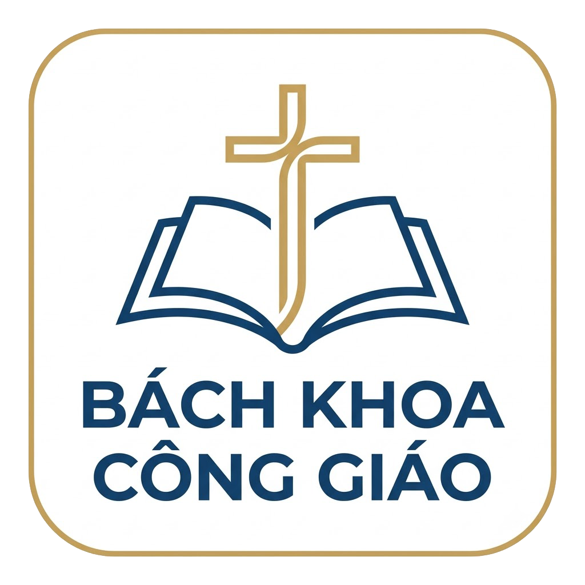

# 🇻🇳 VERICATH WEBAPP - NỀN TẢNG TRA CỨU MỤC VỤ CÔNG GIÁO



> **Vericath Webapp** là cổng thông tin và học thuật Công giáo hiện đại, phục vụ tra cứu Kinh Thánh, Giáo Luật, Giáo Lý, Lịch Phụng Vụ và Văn kiện Hội Thánh với hiệu năng cao, tối ưu trải nghiệm Mobile-First và giao diện song ngữ chuẩn mực.

---

## 🌟 TÍNH NĂNG MỤC VỤ TRỌNG TÂM

### 1. 📖 Kinh Thánh Song Ngữ (Trọn Bộ 73 Sách)
- **73 Sách Công Giáo**: Bao gồm 46 sách Cựu Ước, 27 sách Tân Ước (gồm 7 sách Thứ Kinh: Tôbia, Giuđitha, 1-2 Maccabê, Khôn Ngoan, Huấn Ca, Barúc).
- **Chế độ đối chiếu Đa ngôn ngữ (Parallel Reader)**: Đối chiếu song song giữa bản Việt ngữ (Nhóm CGKPV), Anh ngữ (NABRE), Latinh (Nova Vulgata / Clementina) và Hy Lạp (Septuagint/GNT).
- **Hệ thống chú thích thần học**: Tích hợp các đề mục phân đoạn (`viHeadings`) và chú giải chân trang (`footnotesVi`).

### 2. ⚖️ Bộ Giáo Luật Hội Thánh 1983 (Codex Iuris Canonici)
- Đầy đủ 7 Quyển Giáo luật Công giáo song ngữ Việt - Anh.
- Bộ lọc và thanh tìm kiếm nhảy nhanh đến điều khoản (Can. 1 - Can. 1752).

### 3. ✝️ Lời Chúa Hằng Ngày & Lịch Phụng Vụ
- Tự động đồng bộ Bài đọc 1, Đáp ca, Bài đọc 2 và Phúc Âm theo Lịch Phụng Vụ Việt Nam (`Asia/Ho_Chi_Minh`).
- Hiển thị bậc lễ, màu áo phụng vụ (Trắng, Đỏ, Tím, Xanh) và lời nguyện theo mùa.

### 4. 📚 Giáo Lý Hội Thánh (CCC 1992 & Youcat)
- **Giáo Lý Công Giáo (CCC)**: Trọn bộ 4 phần Giáo lý 1992 với mục lục tương tác.
- **Giáo Lý Giới Trẻ (YOUCAT)**: Trọn bộ 527 câu hỏi - đáp linh hoạt kèm lời trích dẫn các Thánh.

### 5. 🏛️ Sách Lễ Rôma & Văn Kiện Vatican II
- Hệ thống hóa các Văn kiện Công đồng Vatican II và Nghi thức Thánh Lễ Rôma.

---

## 🛠️ CÔNG NGHỆ SỬ DỤNG (TECH STACK)

- **Framework**: [Next.js 15](https://nextjs.org/) (App Router, Dynamic SSR, Edge Proxy APIs).
- **Language**: [TypeScript](https://www.typescriptlang.org/) (Strict Type Definitions, Zero `any`).
- **Styling**: [Tailwind CSS](https://tailwindcss.com/) (Responsive, Custom Design System, Light/Dark Mode).
- **Icons**: [Lucide React](https://lucide.dev/).
- **Data Engine**: Tích hợp JSON Schema cục bộ kết hợp WAF Bypass Edge Proxy nạp dữ liệu mục vụ tự động.

---

## 📂 CẤU TRÚC THƯ MỤC DỰ ÁN

```text
vericath-webapp/
├── public/
│   ├── bible/unified/          # Dữ liệu 73 sách Kinh Thánh & đa ngôn ngữ
│   ├── data/                   # Dữ liệu Lời Chúa, Giáo Luật, Vatican II
│   └── logo.png
├── src/
│   ├── app/                    # Next.js App Router (Pages & API Routes)
│   │   ├── api/                # Edge API proxies & WAF Solvers
│   │   ├── bai-doc-hang-ngay/  # Lời Chúa Hằng Ngày
│   │   ├── giao-luat-cong-giao/# Tra cứu 7 quyển Giáo Luật
│   │   ├── giao-ly-cong-giao/  # Giáo lý CCC
│   │   ├── giao-ly-youcat/     # Giáo lý Youcat (527 câu)
│   │   ├── kinh-thanh-cong-giao/# Đọc Kinh Thánh Song Ngữ
│   │   ├── lich-phung-vu/      # Lịch Phụng Vụ tháng/năm
│   │   ├── sach-le-roma/       # Nghi thức Sách Lễ Rôma
│   │   ├── van-kien-vatican-2/ # 16 Văn kiện Vatican II
│   │   ├── globals.css         # Design tokens & CSS Variables
│   │   ├── layout.tsx          # Root Layout & Metadata
│   │   └── page.tsx            # Trang chủ Vericath
│   ├── components/             # React Client Components (Clean UI)
│   │   ├── BibleReader.tsx     # Bộ đọc Kinh Thánh song ngữ
│   │   ├── CanonLawViewer.tsx  # Bộ xem Giáo Luật
│   │   ├── Header.tsx / Footer.tsx
│   │   ├── PhungVuTuanNayWidget.tsx
│   │   └── ...
│   └── lib/                    # Business Logic Services & Type Definitions
│       ├── bible-service.ts    # Service truy xuất Kinh Thánh
│       ├── giao-luat-server.ts # Service xử lý Giáo Luật
│       ├── liturgy.ts / loi-chua.ts # Service Lịch Phụng Vụ & Lời Chúa
│       └── vericath.ts         # Service kết nối dữ liệu mục vụ
├── next.config.ts
├── package.json
├── postcss.config.mjs
├── README.md
└── tsconfig.json
```

---

## 🚀 HƯỚNG DẪN CHẠY DỰ ÁN LOCAL

### 1. Cài đặt phụ thuộc:
```bash
npm install
```

### 2. Khởi chạy máy chủ phát triển (Development):
```bash
npm run dev
```
Truy cập ứng dụng tại: `http://localhost:3000`

### 3. Đóng gói Production (Build Verification):
```bash
npm run build
npm run start
```

---

## 📜 QUYỀN SỞ HỮU & BẢN QUYỀN

Dự án được xây dựng và duy trì bởi đội ngũ **Vericath** với mục đích phục vụ cộng đồng Công giáo, tuân thủ các quy định về trích dẫn văn bản Mục vụ & Huấn quyền Hội Thánh.
